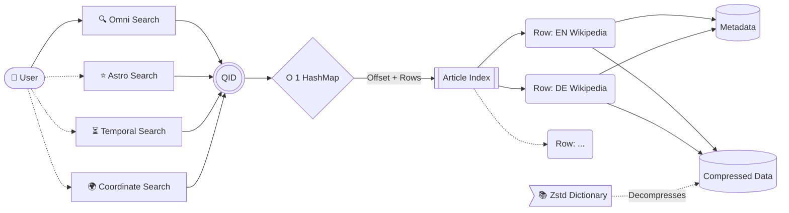

```mermaid
flowchart LR
    User([👤 User])

    %% 1. Search Phase
    User --> OS[🔍 Omni Search]
    User -.-> AS[⭐ Astro Search]
    User -.-> TS[⏳ Temporal Search]
    User -.-> CS[🌍 Coordinate Search]

    %% 2. Resolution
    OS --> Q((( QID )))
    AS --> Q
    TS --> Q
    CS --> Q

    %% 3. Lookup
    Q --> HM{O 1 HashMap}
    HM -->|Offset + Rows| IDX[[Article Index]]

    %% 4. Routing
    IDX --> R1(Row: EN Wikipedia)
    IDX --> R2(Row: DE Wikipedia)
    IDX -.-> RN(Row: ...)

    %% 5. Storage & Decoding
    R1 --> MD[(Metadata)]
    R1 --> DAT[(Compressed Data)]
    
    R2 --> MD
    R2 --> DAT

    ZSTD>📚 Zstd Dictionary] -.->|Decompresses| DAT
```
