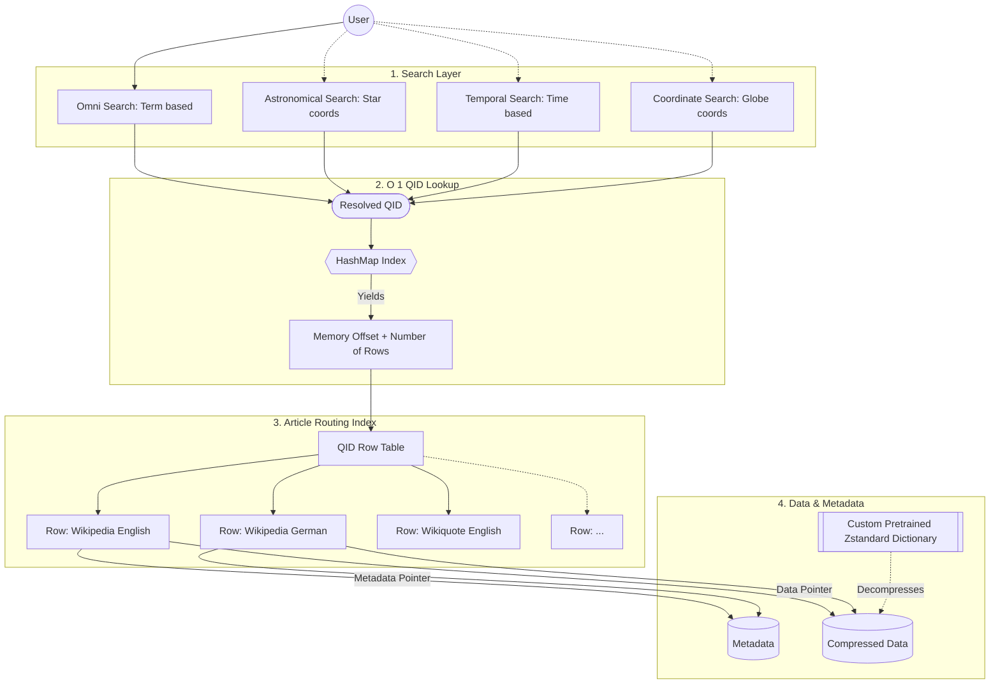

```mermaid
flowchart TD
    User((User))

    subgraph Search_Layer [1. Search Layer]
        OS[Omni Search: Term based]
        AS[Astronomical Search: Star coords]
        TS[Temporal Search: Time based]
        CS[Coordinate Search: Globe coords]
    end

    User --> OS
    User -.-> AS
    User -.-> TS
    User -.-> CS

    OS --> QID([Resolved QID])
    AS --> QID
    TS --> QID
    CS --> QID

    subgraph Lookup [2. O 1 QID Lookup]
        QID --> HM{{HashMap Index}}
        HM -->|Yields| Pointers[Memory Offset + Number of Rows]
    end

    subgraph Routing [3. Article Routing Index]
        Pointers --> AI[QID Row Table]
        AI --> Row1[Row: Wikipedia English]
        AI --> Row2[Row: Wikipedia German]
        AI --> Row3[Row: Wikiquote English]
        AI -.-> RowN[Row: ...]
    end

    subgraph Storage [4. Data & Metadata]
        Row1 -->|Metadata Pointer| Meta[(Metadata)]
        Row1 -->|Data Pointer| Data[(Compressed Data)]
        
        Row2 --> Meta
        Row2 --> Data
        
        ZSTD[[Custom Pretrained Zstandard Dictionary]]
        ZSTD -.->|Decompresses| Data
    end
```
