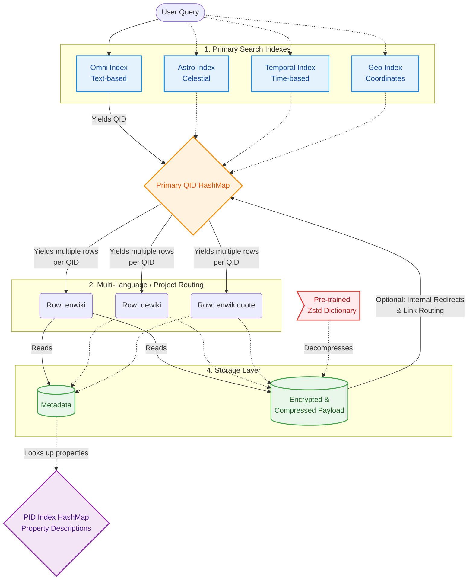

# [Project Name]

A customizable Wiki database generator and query API optimized for embedded and low-power devices like the ESP32.

**NOTE:** This project is under construction. Some features are not thoroughly tested, incompletely implemented, or lacking documentation. This project has only been tested on Fedora so far; other Linux distributions will probably work with little to no tweaking. Native Windows and macOS will not work right now as the database generator currently uses the GNU Coreutils `sort` function. I will implement a platform-independent fallback sorting method in the future. For now, if you are on Windows, you can run the generator inside WSL (Windows Subsystem for Linux). Keep in mind that the query API might change in the future.  

---

## Architecture Overview



---

## This project includes:
- ***[Database Generator](pathtodoc)***
- ***[API for querying the database](pathtodoc)***

## Future Core Functionality (Not everything is implemented right now)
*   Support for **Wikipedia**, **Wiktionary**, (and perhaps **Wikiquotes**, **Wikiversity**, **Wikibooks**, **Wikisource**, and **Wikivoyage**) in any or multiple languages.
*   **Customizable Metadata** based on **Wiki** properties.
*   **Multi-Index Search:**
    *   **Omni Search Index:** Search for **Wikipedia** concepts (QIDs) by text.
    *   **Lexeme Search Index:** Use the database as an offline dictionary based on **Wiktionary**.
    *   **Property (PID) Search Index:** Search for **Wiki** properties to process metadata.
    *   **Global Search Index:** Search for **Wiki** concepts based on their globe coordinates (might be useful in combination with OpenStreetMap).
    *   **Astronomical Search Index:** Search for **Wiki** concepts referring to galaxies, stars, planets, comets, and more using their celestial coordinates.
    *   **Temporal Search Index:** Search for **Wiki** concepts based on their dates (e.g., dates of birth/death for people, start/end dates for historical concepts).
    *   **QID Search Index:** Search **Wiki** concepts directly. Used internally by the API to find articles corresponding to an Omni Search term. Can be used externally to implement automatic offline routing between articles using redirects.
* **Custom Search Tags** based on **Wiki** properties (PIDs). E.g., `is_human`, `is_capital_city`.
* **Search Articles by language.**
*   **Fast Lookups** optimized for SD Cards and low RAM usage using custom data structures and streaming compression, ensuring even large articles that do not fit into RAM can be read. 
*   **Z-Standard Compression** using a pre-trained dictionary with customizable performance metrics such as compression level and size.
*   **Interface to customize article processing:** Turn raw HTML into the format you'd like to have in your database while keeping redirects between articles intact.
*   **Interface to port the Query API to any platform.** 

## Current Functionality:
### Generator:
* Only **Wikipedia** is supported right now (no Wiktionary, Wikibooks, etc.).
* **Multi-language support** for Wikipedia articles.
* **Omni Search Index.**
* **Astronomical Search Index.**
* **Temporal Search Index.**
* **Global Search Index.**
* **Wikipedia** content and customizable metadata.
* **Content compression** (no metadata compression right now) using ZSTD (customizable dictionary size, compression level, etc.).
* All indexes include **customizable search tags**.
* **Partially multithreaded generator pipeline.**

### Query API:
* Functionality for initializing a **DatabaseContext** and querying the following indexes based on your custom tags and language:
  - Omni Search Index
* Initialize a **DataStream** to read articles into a buffer.
* **DatabasePlatform** interface to define your own `read_database_function()` for your specific platform.
* Predefined **DatabasePlatform** for desktops.
* Example program: **Wikipedia Terminal Reader.**

## Priority Feature List
*(Please open an issue if you think there is something you would like added to this list)*
* Fixing bugs that I don't know about yet.
* Add API support for the **Temporal Search Index**, **Global Search Index**, **Astronomical Search Index**, direct **QID Search Index**, and **PID Search Index**.
* **Wiktionary** support.
* Decide whether to properly support other wikis such as **Wikibooks**. This is a pain in the a** because, unlike Wikipedia articles, a Wiki Book consists of multiple chapters that need to be individually parsed and linked. This prevents me from using the same pipeline as Wikipedia articles, and considering the small size of those other wikis compared to Wikipedia, it might not be worth it.
* Making the generator work on Windows (or maybe not, because people should switch to Linux anyway).
* Implementing a better default processing function for articles. Additionally, an easy way to turn redirects into QIDs would be nice so offline redirecting can be implemented (using the QID Index).
* Performance improvements (focusing on the API).

---

## Quick Start
*Note*: As of right now, this project has only been tested on Fedora. Other Linux distributions should work as well, but it will break under Windows/macOS natively. 

### 0. Prerequisites

In order to build and run this project, you will need `cargo` and `gcc` for compiling Rust and C:

*Cargo*:
```bash
curl [https://sh.rustup.rs](https://sh.rustup.rs) -sSf | sh
```

*Development Tools including gcc:*

*Fedora:*
```bash
# TODO: update system
sudo dnf group install "Development Tools"
```

*Ubuntu/Debian:*
```bash
sudo apt update
sudo apt install build-essential
```

*Arch:*
```bash
sudo pacman -Syu
sudo pacman -S gcc
```

### 1. Clone this repository and build
To get started, clone this directory using the following commands:
*(TODO: Change repo_name)*
```bash
git clone [https://github.com/jmueller209/repo_name.git](https://github.com/jmueller209/repo_name.git)
cd repo_name
```

### 2. Customize Configuration
Before running the database generator, you can customize the configuration [here](config/config.toml). The file contains comments explaining what each setting does. If you only want to get started quickly and do not want to spend much time reading docs, you might only want to consider the following settings:
*   `create_globe_coordinate_search_index` // Supported by generator but not by API as of right now
*   `create_temporal_search_index` // Supported by generator but not by API as of right now
*   `create_astronomical_search_index` // Supported by generator but not by API as of right now
*   `ram_limit_mb`  // RAM your computer is allowed to use for the database generation
*   `thread_count` // Number of threads/cores the generator is allowed to use

To configure which languages you want to include, take a look at the [official Wikipedia Documentation](https://en.wikipedia.org/wiki/List_of_Wikipedias). Here you’ll find a table containing information about the Wikipedias in all available languages. Even though this documentation only talks about Wikipedia articles and no other Wikis, the language codes used are the same. Open the [language configuration](config/languages.config) and add the language codes referring to the languages you want to include. 

*Note*: There might be several language codes for a given language that refer to different dialects or standardizations. E.g., there is `de` referring to standard German and `nds` referring to a specific Low German dialect. 

### 3. Run The Generator
Generating the database is quite computationally expensive as we have to parse very large files. To give you a short summary of the most time-consuming processing steps:
1. Downloading database dumps (Compressed Metadata archive: ~150GB, Compressed Data archives: ~1-50GB per wiki per language).
2. Decompressing, parsing, and processing the Metadata Archive (In its uncompressed form, the Metadata Archive is a ~1TB JSON file).
3. Decompressing, parsing, processing, and recompressing Data archives (For each Wikipedia article, wiki book, etc., we need to decompress its data in the dump file which contains raw HTML, process the data by removing HTML tags, compress the processed data, and save it).

For testing (which I highly recommend given the current state of the project), run the following command from the root of this repository:
```bash
make test-pipeline
```
This will first download the necessary database dumps and then start processing the data and generating the database with a very small number of articles to finish quickly. Note that the download will probably still take a long time, but fortunately, this will only be done once. 

You can change the config file (except the language config, the `wikis_to_include`, and the `data_dir` settings) and run the `make test-pipeline` command again to generate a new database. You can run:
```bash
make clean
```
to clean up everything **EXCEPT** the downloads. If you want to clean up everything including the downloads, run:
```bash
make purge
```
If you actually want to generate the entire database, you can run:
```bash
make resume
```
to keep generating from the last checkpoint, or 
```bash
make restart-clean
```
to restart the database generation using the already existing downloads, or
```bash
make restart-purge
```
to restart the database generation including removing the old downloads and pulling the latest data. 

Even though some of the steps that require heavy compute are multithreaded, generating the ENTIRE database will still take many hours. To avoid having to run your computer for 30 hours straight, the generator creates checkpoints from which it can resume when you run the `make resume` command. Downloads will be resumed automatically at the point where they were stopped. Keep in mind, though, that some of the larger processing steps that require heavy decompression must be run in one go. Exiting the generator early will not result in data corruption; however, a lot of progress might be lost. 

### 4. Test The Database
After generating the database (even if you only ran the `test-pipeline` command), you can run an example program that uses the query API to allow you to search through the database and read articles directly in your terminal. Just run:
```bash
make test-db-api
```
If you want to run in DEBUG mode, use:
```bash
make test-db-api-debug
```
If you want to profile heap memory usage, run:
```bash
make test-db-api-valgrind
```

