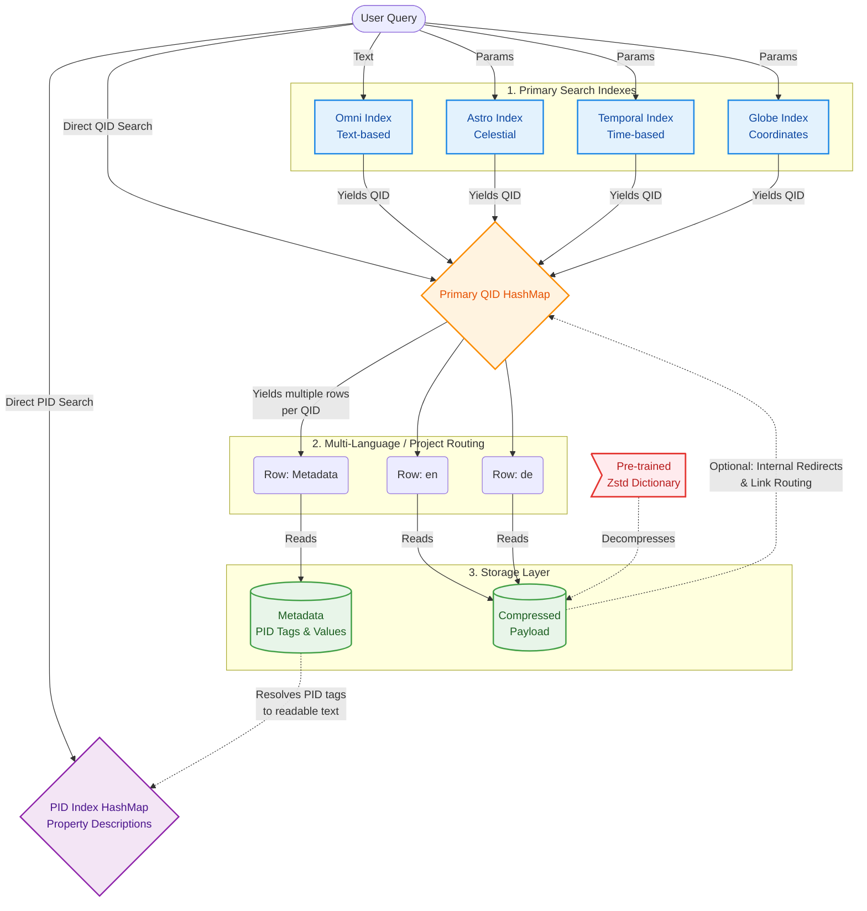

# WIKI_PDA

[](https://opensource.org/licenses/MIT)

**Offline Wikipedia engine for embedded systems.**
A customizable Wiki database generator + lightweight C Query API optimized for microcontrollers like the ESP32.


> [!Warning]  
> This project is under construction. Some features are not thoroughly tested, incompletely implemented, or lacking documentation. This project has only been tested on Fedora so far; other Linux distributions will probably work with little to no tweaking. Windows will work in combination with Windows Subsystem for Linux (WSL). MacOS is not supported as of right now.  

---

## Architecture Overview (See the [documentation](docs/database_architecture.md) for more details)



---

## This project includes:
- ***[Database Generator](docs/generator_pipeline.md)***
- ***[API for querying the database](docs/query_api.md)***

## Current Functionality:
### Generator:
* Generates offline **Wikipedia** database.
* **Multi-language support** for Wikipedia articles.
* Generation of the following **search indexes**:
  - **Omni Search Index.**
  - **Astronomical Search Index.**
  - **Temporal Search Index.**
  - **Global Search Index.**
  - **QID Search Index.**
  - **PID Search Index.**
* customizable **Wikipedia** content and metadata.
* **Content compression** (no metadata compression right now) using ZSTD (customizable dictionary size, compression level, etc.).
* All indexes include **customizable search tags** (E.g., `is_human`, `is_capital_city`).
* **Partially multithreaded generator pipeline.**
* Tool to partition storage media and **flash database** to it.

### Query API:
* Functions for initializing a **DatabaseContext** and querying the following indexes based on your custom tags and language:
  - Omni Search Index
  - Globe Coordinate Search Index
  - Astronomical Search Index
  - Temporal Search Index
  - QID & PID Search
+ **Fast Lookups** optimized for SD Cards and low RAM usage using custom data structures and streaming compression, ensuring even large articles that do not fit into RAM can be read.
* **DatabasePlatform** interface to define your own `read_database_function()` for your specific platform.
* Predefined **DatabasePlatform** for desktop and Teensy4.1.
* Example program: **Wikipedia Terminal Reader.**

## Future Plans
* Multi language **Wiktionary** support. 
* Add **Interface to customize article processing:** Turn raw HTML into the format you'd like to have in your database while keeping redirects between articles intact.
* Add more Examples on how to use the API (on PC and ESP32).
* Downloadable preconfigured Databases (avoid running the heavy generator).
* Add predefined **DatabasePlatform** for ESP32.
* Performance improvements (focusing on the API).
* Fix bugs.
---

## Quick Start
*Note*: As of right now, this project has only been tested on Fedora. Other  distributions should work as well, but it will break under Windows/macOS natively. 

### 0. Prerequisites

In order to build and run this project, you will need `cargo` and `gcc` for compiling Rust and C:


*Windows*:

Install Windows Subsystem for Linux (WSL) by opening the Powershell and running `wsl --install`. This will automatically install Ubuntu. If you want to install a different distribution or need more information, visit `https://learn.microsoft.com/en-us/windows/wsl/install` for help. Once the installation has finished, close Powershell and open the WSL-Shell (You can just search for WSL). Once you are inside WSL, continue with the setup process by following the instructions for your installed Linux distribution below. From now on all the documented commands should be run from the WSL-Shell.

*Fedora:*
```bash
sudo dnf upgrade --refresh
curl --proto '=https' --tlsv1.2 -sSf https://sh.rustup.rs | sh
sudo dnf install @development-tools   
```

*Ubuntu/Debian:*
```bash
sudo apt update
curl --proto '=https' --tlsv1.2 -sSf https://sh.rustup.rs | sh
sudo apt install build-essential
```

*Arch:*
```bash
sudo pacman -Syu
curl --proto '=https' --tlsv1.2 -sSf https://sh.rustup.rs | sh
pacman -S devtools
```

### 1. Clone this repository
To get started, clone this directory using the following commands:
```bash
git clone https://github.com/jmueller209/WIKI_PDA.git
cd WIKI_PDA
```

### 2. Customize Configuration
Before running the database generator, you can customize the configuration [here](config/config.toml). The file contains comments explaining what each setting does. If you only want to get started quickly and do not want to spend much time reading docs, you might only want to consider the following settings:
*   `create_globe_coordinate_search_index` // Supported by generator but not by API as of right now
*   `create_temporal_search_index` // Supported by generator but not by API as of right now
*   `create_astronomical_search_index` // Supported by generator but not by API as of right now
*   `ram_limit_mb`  // RAM your computer is allowed to use for the database generation
*   `thread_count` // Number of threads/cores the generator is allowed to use

To configure which languages you want to include, take a look at the [official Wikipedia Documentation](https://en.wikipedia.org/wiki/List_of_Wikipedias). Here you’ll find a table containing information about the Wikipedias in all available languages. Even though this documentation only talks about Wikipedia articles and no other Wikis, the language codes used are the same. Open the [language configuration](config/languages.config) and add the language codes referring to the languages you want to include. 

*Note*: There might be several language codes for a given language that refer to different dialects or standardizations. E.g., there is `de` referring to standard German and `nds` referring to a specific Low German dialect. 

### 3. Run The Generator
Generating the database is quite computationally expensive as we have to parse very large files. To give you a short summary of the most time-consuming processing steps:
1. Downloading database dumps (Compressed Metadata archive: ~150GB, Compressed Data archives: ~1-50GB per wiki per language).
2. Decompressing, parsing, and processing the Metadata Archive (In its uncompressed form, the Metadata Archive is a ~1TB JSON file).
3. Decompressing, parsing, processing, and recompressing Data archives (For each Wikipedia article, wiki book, etc., we need to decompress its data in the dump file which contains raw HTML, process the data by removing HTML tags, compress the processed data, and save it).

Before you get started make sure you have enough free space on your disk (A few hundred gigabytes). If you have multiple drives, this directory or at least the relevant configurable paths in the config should be located on the fastest disk that has enough space available since reading from and writing to disk can be a bottleneck during some steps of the generation phase. For testing (which I highly recommend given the current state of the project), run the following command from the root of this repository:
```bash
make test-pipeline
```
This will first download the necessary database dumps and then start processing the data and generating the database with a very small number of articles to finish quickly. Note that the download will probably still take a long time, but fortunately, this will only be done once. 

You can change the config file (except the language config, the `wikis_to_include`, and the `data_dir` settings) and run the `make test-pipeline` command again to generate a new database. You can run:
```bash
make clean
```
to clean up everything **EXCEPT** the downloads. If you want to clean up everything including the downloads, run:
```bash
make purge
```
If you actually want to generate the entire database, you can run:
```bash
make resume
```
to keep generating from the last checkpoint, or 
```bash
make restart-clean
```
to restart the database generation using the already existing downloads, or
```bash
make restart-purge
```
to restart the database generation including removing the old downloads and pulling the latest data. 

Even though some of the steps that require heavy compute are multithreaded, generating the ENTIRE database will still take many hours. To avoid having to run your computer for 30 hours straight, the generator creates checkpoints from which it can resume when you run the `make resume` command. Downloads will be resumed automatically at the point where they were stopped. Keep in mind, though, that some of the larger processing steps that require heavy decompression must be run in one go. Exiting the generator early will not result in data corruption; however, a lot of progress might be lost. 

### 4. Test The Database
After generating the database (even if you only ran the `test-pipeline` command), you can run an example program that uses the query API to allow you to search through the database and read articles directly in your terminal. Just run:
```bash
make test-db-api
```
If you want to run in DEBUG mode, use:
```bash
make test-db-api-debug
```
If you want to profile heap memory usage, run:
```bash
make test-db-api-valgrind
```

## Contribution
Any contributions, thoughts, and suggestions are very welcome. Because I just created this project, my documentation currently focuses mainly on how to get started quickly and how to use the query API. I don't have a lot of the deeper, under-the-hood documentation written yet that makes contributing easy, but I will be adding that step by step in the future. If you would still like to contribute to a specific part of the project right now, please open an issue! This way, I can either answer your questions directly or prioritize writing the documentation for that specific area to help you get started easier.

## License
This project is licensed under the MIT License - see the [LICENSE](LICENSE) file for details.

