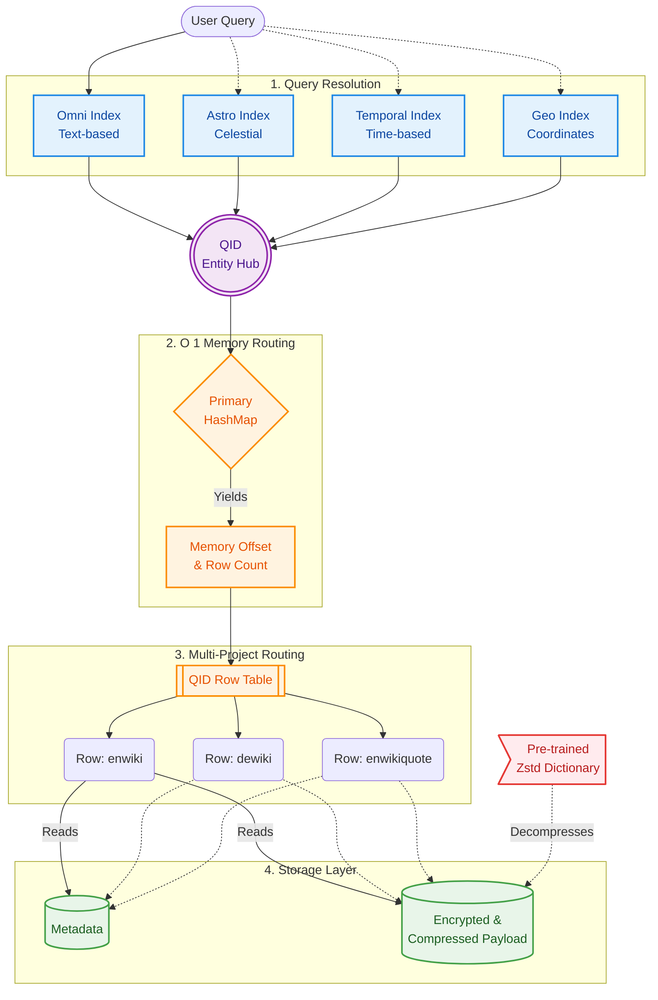

# [Project Name]

A customable Wiki database generator optimized for embedded and low power devices like the ESP32.

**📖 [Full Documentation](link-to-docs)**

---

## Core Functionality
*   Support for **Wikipedia**, **Wiktionary**, **Wikiquotes**, **Wikiversity**, **Wikibooks**, **Wikisource** and **Wikivoyage** in any or multiple languages.
*   **Multi-Index Search:**:
    - Omni Search Index: Search wiki concepts by text.
    - Global Search Index (optional): Search wiki concepts based on their globe coordinates (Might be     useful in combination with Open Street Maps).
    - Astronomical Search Index (optional): Search astronomical objects like Galaxies, Stars, Planets, Comets and     more using their celestial coordinates.
    - Temporal Search Index (optional): Search Search wiki concepts based on their data (e.g. data of     birth/death for people, start/end dates for historical concepts.
*   **Fast Lookups** optimized for SD Cards and low RAM usage.
*   **Z-Standard Compression** using a pre trained dictionary with customable performance metrics.
*   **Customable Metadata** based on wiki properties.

---

## Architecture Overview



---

## Quick Start
*Note*: As of right now, this project has only been tested on Fedora. Other Linux distributions should work as well but it will probably break under Windows/Mac. 

*(See [Documentation](link) for detailed steps)*

### 0. Prerequisites


In order to build and run this project you will need `cargo` and `gcc` for compiling Rust and C:

*cargo*:
```bash
curl https://sh.rustup.rs -sSf | sh
```

*Development Tools including gcc:*

*Fedora:*
```
TODO: update system
sudo dnf group install "Development Tools"
```

*Ubuntu/Debian:*
```
sudo apt update
sudo apt install build-essential
```

*Arch:*
```
sudo pacman -Syu
sudo pacman -S gcc
```

### 1. Clone this repository and build
To get started, clone this directory using the following commands:
TODO: Change repo_name
```bash
git clone https://github.com/jmueller209/repo_name.git
cd repo_name
```
Once you are in this projects local directory you can compile the project using:
```
make build
```

### 2. Customize Configuration
Before running the database generator you can customize the configuration [here](config/config.toml). The file contains comments explaining what each setting does. A more detailed explanation for some of the setting will be given in the detailed [documentation](””). If you only want to get started quickly and not want to spend much time reading docs you might only want to consider the following settings:
*    `wikis_to_include`
*    `create_clobe_coordinate_search_index`
*    `create_temporal_search_index`
*    `create_astronomical_search_index`

To configure which languages you want to include, take a look at the [The official Wikipedia Documentation](https://en.wikipedia.org/wiki/List_of_Wikipedias). Here you’ll find a table containing information about the Wikipdias in all available languages. Even though this documentation only talks about Wikipedia articles and not wiki books for example, the language codes used are the same. Open the [language configuration](config/languages) and add the language codes referring to the languages you want to include. 

*Note*: There might be several language codes for a given language that refer to different dialects or *difficulties*. E.g. There is `en` referring to standard German and `nds` referring to a specific low German dialect. 

### 3. Run The Generator
To run the entire generator, you can run the following command from the repository root:
```
make db
```
This will first download the necessary database dumps and then start processing the data and generating the database. Running the entire generator at once will take a long time as the files we are dealing with are huge. Just to give you a short summary of the most time consuming processing steps:
1. Downloading database dumps (Compressed Metadata archive: ~150GB, Compressed Data archives: ~1-50GB per wiki per language)
2. Uncompressing, parsing and processing Metadata Archieve (In its uncompressed form the Metadata Archieve is a ~1TB JSON file)
3. Uncompressing, parsing, processing and recompressing Data archives (For each Wikipedia article, wiki book, etc. we need to decompress its data in the dump file which contains raw html, process the data (remove html tags, etc.), compress the processed data and save it).

Even though some of the steps that require heavy compute are multithreaded, processing will still take many hours. To avoid having to run your computer for 30 hours straight, the generator creates checkpoints from which it can resume when you rerun the `make db` command. Downloads will be resumed automatically at the point where they were stopped. Keep in mind though that some of the larger processing steps that require heavy decompression must be run in one go. Exiting the generator early will not result in data corruption; however, a lot of progress might be lost. 

